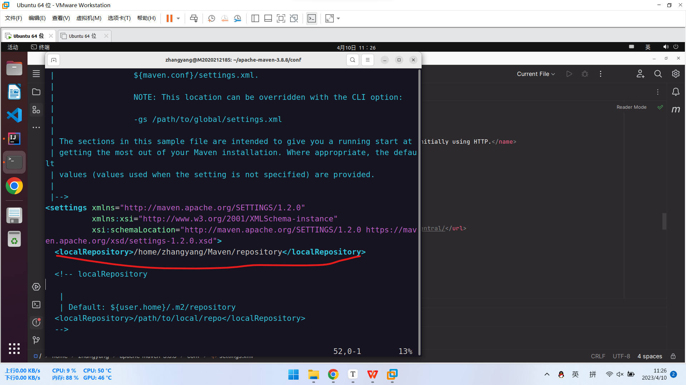
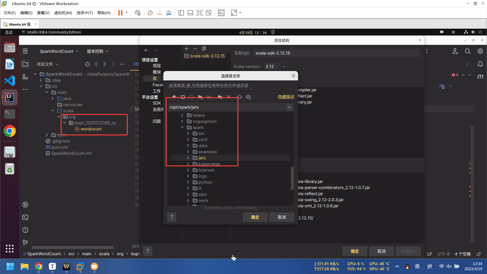

<!--
 * @Author: jonnyzhang02 71881972+jonnyzhang02@users.noreply.github.com
 * @Date: 2023-04-10 11:06:53
 * @LastEditors: jonnyzhang02 71881972+jonnyzhang02@users.noreply.github.com
 * @LastEditTime: 2023-04-18 21:20:33
 * @FilePath: \dsj_lab3\lab3.md
 * @Description: coded by ZhangYang@BUPT, my email is zhangynag0207@bupt.edu.cn
 * 
 * Copyright (c) 2023 by zhangyang0207@bupt.edu.cn, All Rights Reserved. 
-->
# 实验三：大数据离线数据分析实践-MapReduce+Spark


[TOC]

本报告使用了PDF书签，建议打开，可以快速跳转到不同章节

**思维导图**


## 一、HADOOP MAPREDUCE WORDCOUNT案例实现

### 1、按照实验二的方法创建 java 项目并配置 Maven。

修改/apache-maven-3.8.7/conf/settings.xml，在其中添加如下配置

```xml
<mirror>
    <id>alimaven</id>
    <mirrorOf>central</mirrorOf>
    <name>aliyun maven</name>
    <url>http://maven.aliyun.com/nexus/content/repositories/central/</url>
</mirror>
<mirror>
    <id>aliyunmaven</id>
    <mirrorOf>*</mirrorOf>
    <name>阿里云公共仓库</name>
    <url>https://maven.aliyun.com/repository/public</url>
</mirror>
```

**张扬2020212185的截图**


```xml
<localRepository>你自己的本地仓库路径</localRepository>
```

**张扬2020212185的截图**



### 2、pom.xml 文件

特别注意这里，`org.bupt_185_194_135` 为包名，`WordCountMain` 为主类名，在后续的新建 Java 类时，注意修改为自己所创建的包和主类

**张扬2020212185的截图**


#### ***出现的问题:找不到插件***

找不到`Plugin org.apache.maven.plugins:maven-ctean-ptugin：2.5`

**张扬2020212185的截图**


花了很长时间解决，用了很多办法，最中解决方法是是：

再次**确认maven主路径**，**用户设置文件**，**本地仓库的位置**，**修改相关配置文件**，**取消ssl验证**

**张扬2020212185的截图**


**张扬2020212185的截图**


然后**强制重新下载插件**，报错消失。

### 3、编写 Mapper、Reducer、Main 代码

在包下创建 `WordCountMain`、`WordCountMapper`、`WordCountReducer` 三个类（自己命名）

**张扬2020212185的截图**


### 4、将程序打成 jar 包

（1）点击右上角的 `Maven`

（2）双击 `Lifecycle` 中的 `package` 进行打包

`Lifecycle`:生命周期

此处为顺序执行，当你双击一个阶段时，它会按顺序从上到下执行每个阶段，比如双击 `install`，

它会先执行 `clean`，再执行 `validate`……直到顺序执行完 `install` 停止。

每个阶段的作用：

- clean：清除之前构建生成的所有文件，即 target 目录及目录下所有文件
- validate：验证项目的正确性
- compile：编译整个项目的源代码，Java 文件
- test：测试 compile 中编译出的代码
- package：打包 compile 中编译的代码，分类到文件夹内，即生成 target 目录及目录下的内容
- verify：验证 test 的结果是否符合标准
- install：将包安装到本地供其他项目使用
- site：生成项目的站点文档
- deploy：将包复制到远程仓库

（3）此时经过 `maven` 的编译打包，即可在我们项目路径的 target 目录下生成项目的 jar 包。

**张扬2020212185的截图**


### 5、上传 jar 包到配置有 hadoop 环境中。

**找到 jar 包位置**

**张扬2020212185的截图**


将 `jar` 包移动到`/opt/hadoop` 文件夹下。

**张扬2020212185的截图**


TODO: 完全分布


## 二、*Spark*伪分布式环境配置

### 1、安装 Scala

#### （1）下载安装

```shell
cd ~  
wget https://downloads.lightbend.com/scala/2.12.15/scala-2.12.15.tgz
```


#### （2）解压

```shell
tar -zxvf scala-2.12.15.tgz
mv scala-2.12.15 /usr/scala-2.12.15
```

#### （3）环境变量

```shell
vim /etc/profile
```

我(2020212185张扬)的是：

```shell
vim ~/.zshrc 
```

输入：

```properties
export SCALA_HOME=/usr/scala-2.12.15
export PATH=$PATH:$SCALA_HOME/bin
```


环境变量生效：

```shell
source ~/.zshrc
```

#### （4）检验是否安装成功

```shell
scala -version
```


### 2、安装 spark

#### （1）下载 spark 安装包

```shell
cd ~ 
wget https://dlcdn.apache.org/spark/spark-3.2.3/spark-3.2.3-bin-without-hadoop.tgz
```


**404**了，看了官网，最接近的是`3.2.4`，改用`3.2.4`

```shell
wget https://dlcdn.apache.org/spark/spark-3.2.4/spark-3.2.4-bin-without-hadoop.tgz
```


太慢了，改用群内安装包


#### （2）解压安装包，移动位置，重命名。

```shell
cd ~
tar -zxf spark-3.2.3-bin-without-hadoop.tgz
mv spark-3.2.3-bin-without-hadoop /opt/spark
```


#### （3）配置环境变量

为了方便操作，为 spark 配置环境变量：

```shell
sudo vim /etc/profile
vi ~/.zshrc
```


更新环境变量：

```shell
source  ~/.zshrc
```

#### （4）Spark 文件配置

##### a. 配置 `spark-env.sh` 文件

将 `spark-env.sh.template` 拷贝到 `spark-env.sh`：

```shell
cp  /opt/spark/conf/spark-env.sh.template  /opt/spark/conf/spark-env.sh
```


```shell
vim /opt/spark/conf/spark-env.sh
```


变量名解释

- `JAVA_HOME` jdk 的安装目录
- `SCALA_HOME` scala 的安装目录
- `HADOOP_CONF_DIR` hadoop 的配置文件存放目录
- `SPARK_DIST_CLASSPATH` 有了 SPARK_DIST_CLASSPATH 配置信息以后，Spark就可以读写 Hadoop 分布式文件系统 HDFS
- `SPARK_MASTER_IP` spark 主节点绑定的地址
- `SPARK_MASTER_PORT` spark 主节点绑定的端口号
- `SPARK_MASTER_WEBUI_PORT` spark master 节点的网页端口

#### （5）启动 spark

```shell
cd /opt/spark
sbin/start-all.sh
```

执行 jps 指令

```shell
jps
```

可以看到，有一个 `worker` 和一个 `master`


打开 http://ip:8080 , web 界面显示有一个节点，配置成功


#### （6）用自带样例测试

`bin/spark-submit` 是用于提交 Spark 应用程序的命令。它接受多个参数，其中一些是必需的，而另一些则是可选的。以下是 `bin/spark-submit` 命令的常用参数：

**必需参数**

- `--class`: 主类名称，即包含 `main` 方法的类的完全限定名。
- `--master`: Spark 集群的URL或运行模式。例如，可以将其设置为 "local" 以在本地运行应用程序，或将其设置为 "spark://HOST:PORT" 以连接到远程 Spark 集群。

```shell
sudo bin/spark-submit  --master spark://M2020212185:7077  --class org.apache.spark.examples.SparkPi  /opt/spark/examples/jars/spark-examples_2.12-3.2.3.jar 10
```

这个命令是将 Spark 官方示例程序 `SparkPi` 提交到 Spark 集群上运行，并计算π的近似值。下面是该命令的解释：

- `bin/spark-submit`: 提交 Spark 应用程序的命令。
- `--master spark://M2020212185:7077`: 指定 Spark 集群的 URL。这里的 URL 是 `spark://M2020212185:7077`，其中 `M2020212185` 是主机名，`7077` 是 Spark 主节点的端口号。
- `--class org.apache.spark.examples.SparkPi`: 指定应用程序的主类名称。在这里，主类是 `org.apache.spark.examples.SparkPi`，该类包含计算 π 的近似值的代码。
- `/opt/spark/examples/jars/spark-examples_2.12-3.2.3.jar`: 应用程序的 JAR 文件路径。这里的 JAR 文件是 Spark 示例程序的 JAR 文件，其中包含 `SparkPi` 类的代码。
- `10`: 应用程序参数。在这里，它是应用程序将使用的分区数。

此命令将提交 `SparkPi` 应用程序到 Spark 集群，并使用 10 个分区计算 π 的近似值。可以在 Spark UI 上查看应用程序的状态和进度。


出现问题：


`\`没有生效？

合成一行，成功运行：


结果：


### 3、本地运行 wordcount 程序

#### （1）创建 Maven 工程


#### （2）配置 Maven

在 IDEA 中打开 File/Settings/Build,Execution,Deployment/Build Tools/Maven ，分别设置其中的 Maven home path 、 User setting file 和 Local repository 为你的 maven 安装目录、安装目录下的 /apache-maven-3.8.7/conf/settings.xml 和自己的本地仓库路径。


#### （3）新建文件夹 scala，并且将文件夹设置为 sources root


#### （4）添加 scala library

发现没有scala library


应该是权限的问题，复制到/home/zhangyang目录下试试，没用

查过之后应该是没装IDEA插件


装上之后就有了


#### （5）添加 scala 插件，先在 settings-plugins 中下载安装

应该在（4）之前做，已经装好

#### （6）创建 scala class


#### （7）上传测试文件

用群里给的文件 ceshi.txt，上传到/opt/hadoop/ceshi.txt 中。（任意路径均可）


#### （8）代码

```java
package org.bupt_2020212185_zy

import org.apache.spark.{SparkContext, SparkConf}

object sparkwordcount {

  def main(args: Array[String]): Unit = {
    val conf = new SparkConf().setAppName("WordCount").setMaster("local")

    val sc = new SparkContext(conf)

    val lines = sc.textFile("/opt/hadoop/ceshi.txt") // 读取本地文件，注意修改本地文件的位置。

    val words = lines.flatMap(_.split(" ")).filter(word => word != " ") // 拆分单词，并过滤掉空格，当然还可以继续进行过滤，如去掉标点符号
    val pairs = words.map(word => (word, 1)) // 在单词拆分的基础上对每个单词实例计数为1, 也就是 word => (word, 1)
    val wordscount = pairs.reduceByKey(_ + _) // 在每个单词实例计数为 1 的基础之上统计每个单词在文件中出现的总次数, 即 key 相同的 value 相加
    // val wordscount = pairs.reduceByKey((v1, v2) => v1 + v2) // 等同于
    wordscount.collect.foreach(println) // 打印结果，使用 collect 会将集群中的数据收集到当前运行 drive 的机器上，需要保证单台机器能放得下所有数据
    sc.stop() // 释放资源

  }
    
}

```

##### ***出现的问题，搞了好几天，重装了好几次，最终通过更新JavaCA证书解决***

问题：找不到`org.apache.spark`


在项目中引入spark：




maven好像出问题了，在root权限下，重装maven


问题仍然存在

**并且变成了在IJ中，maven 的所有plugin均标红，aven 的所有plugin均not found**

尝试在命令行中使用“`mvn clean install`”命令清理本地仓库，并重新构建项目。这将强制Maven重新下载并安装所有插件和依赖项。

运行mvn clean install后报错

```
[ERROR] Plugin org.apache.maven.plugins:maven-clean-plugin:3.2.0 or one of its dependencies could not be resolved: Failed to read artifact descriptor for org.apache.maven.plugins:maven-clean-plugin:jar:3.2.0: The following artifacts could not be resolved: org.apache.maven.plugins:maven-clean-plugin:pom:3.2.0 (absent): Could not transfer artifact org.apache.maven.plugins:maven-clean-plugin:pom:3.2.0 from/to aliyunmaven (https://maven.aliyun.com/repository/central): java.lang.RuntimeException: Unexpected error: java.security.InvalidAlgorithmParameterException: the trustAnchors parameter must be non-empty -> [Help 1]
```

这个错误提示表明使用的阿里云镜像仓库无法获取所需的maven插件或其依赖项

**可能是因为Java的CA证书过期或缺失导致的**。

尝试更新或重新安装Java的CA证书，然后重试使用阿里云镜像仓库。具体的操作步骤如下：

1. 首先确定Java运行环境所在的目录，一般是在 /usr/Java8/jvm/ 目录下，你可以执行以下命令查看已安装的Java版本：

   ```bash
   ls /usr/Java8/jvm/
   ```

2. 进入Java运行环境所在目录，如：

   ```shell
   cd /usr/lib/jvm/java-1.8.0-openjdk-amd64
   ```

3. 进入 /jre/lib/security 目录：

   ```shell
   cd jre/lib/security
   ```

4. 备份当前的 cacerts 文件：

   ```shell
   sudo cp cacerts cacerts.backup
   ```

5. 下载最新的 Java CA 证书文件：

   ```shell
   sudo wget https://curl.se/ca/cacert.pem
   ```
   
   **张扬2020212185的截图**
   
   
   
6. 运行以下命令更新 Java CA 证书：

   ```shell
   sudo keytool -importcert -file cacert.pem -alias new_alias -keystore cacerts
   ```

   在运行此命令时，会提示输入密码。如果没有特别设置过，Java 默认的 keystore 密码为 "changeit"。

7. 输入 "yes" 确认安装该证书。

**张扬2020212185的截图**


8. 重新启动 Maven，然后再次尝试使用阿里云镜像仓库进行依赖的下载和构建。

9. 能够下载，并且不再标红

**张扬2020212185的截图**


#### （9）在本地模式下运行

直接运行

成功！

**张扬2020212185的截图**


## 三、*Spark*完全分布式环境配置

1、下载 spark 安装包。也可使用群内安装包。同伪分布式

2、解压安装包，移动位置，重命名。同伪分布式

3、配置环境变量。同伪分布式

4、Spark 配置。（只主节点做）

在 Master 节点主机上进行如下操作：

### （1）配置 slaves 文件

将 slaves.template 拷贝到 slaves：

```bash
cp /opt/spark/conf/workers.template /opt/spark/conf/workers
```


打开：

```bash
vim /opt/spark/conf/workers
```

编辑配置文件如下图：

**张扬2020212185的截图**


### （2）配置 spark-env.sh 文件

将 spark-env.sh.template 拷贝到 spark-env.sh

```shell
cp /opt/spark/conf/spark-env.sh.template /opt/spark/conf/spark-env.sh
```


打开：

```bash
vim /opt/spark/conf/spark-env.sh
```

配置文件内容如下：

**张扬2020212185的截图**


### （3）配置好后，将 Master 主机上的/opt/spark 文件夹复制到各个节点上。

Master 执行：

```bash
scp -r /opt/spark/conf S2020212185:/opt/spark/
```

**张扬2020212185的截图**


### 启动 spark 集群

在主节点主机上运行如下命令：

```shell
cd /opt/spark/
sbin/start-all.sh
```

在 Master 节点上运行 `jps` 命令，可以看到多了 `Master` 进程和 `worker` 进程：

**张扬2020212185的截图**

在 slave节点上运行 `jps` 命令，可以看到多了个 `Worker` 进程：

**张扬2020212185的截图**


### 在浏览器上查看 *Spark* 独立集群管理器的集群信息

打开浏览器，访问 `http://10.243.164.219:8080,`如下图：

通过浏览器访问端口查看主节点现在状，状态表示：worker 节点有 2 个，当前没有任务在执行，完成的任务数量为 0

#### ***出现的问题：WebUI总是显示不出来slave的worker***

​	我的slave节点IP是10.243.14.92,**由于改成主机名（slave自己jps有worker）**

分别修改master和slave的配置文件：相比指导书上的多了一些内容

**张扬2020212185的截图**


**张扬2020212185的截图**


#### **然后成功运行！**

**张扬2020212185的截图**


## 四、*Spark*完全分布运行 wordcount 程序

### 1、创建工程：同单机伪分布的方法

**张扬2020212185的截图**


### 2、代码

`pom.xml`

**张扬2020212185的截图**


`wordcount.scala` 程序：

**张扬2020212185的截图**


### 3、打包

**张扬2020212185的截图**


### 4、将 jar 包复制到 /opt/spark 文件夹中

**找到 jar 包的位置：**

**张扬2020212185的截图**


**复制：**

**张扬2020212185的截图**


### 5、运行

（1）开启 hadoop

（2）开启 spark

**张扬2020212185的截图**


（3）上传测试文件到 hadoop，此处使用 MapReduce 的测试文件 ceshi.txt

**张扬2020212185的截图**


（4）提交任务

```bash
cd /opt/spark 
bin/spark-submit --class org.bupt_2020212185_zy.wordcount --master spark://10.243.164.219:7077 sparkwordcount_pro-1.0-SNAPSHOT.jar
```

**张扬2020212185的截图**


**张扬2020212185的截图**


（5）运行结果

**张扬2020212185的截图**


### #######完美运行！######
